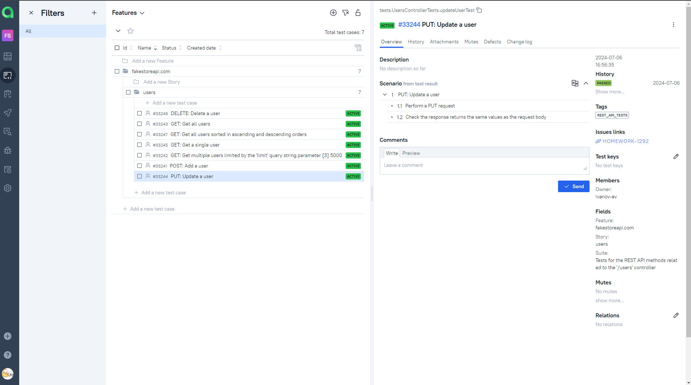

# Sample Test Automation Project in Java for the [FAKESTOREAPI.COM](https://fakestoreapi.com/) Website (REST API)

---
Fakestore.com is a website that provides a sample REST API intended for learning purposes.

<a href="https://fakestoreapi.com/"></a>

> [!NOTE]
> This is my final project for the 'Java Test Automation' course at <a href="https://qa.guru">QA.GURU</a>. 
> The project is provided as a demonstration of my skills in REST API tests. 
> Keeping the project up to date is not guaranteed.
> 
> Access to Jira, Jenkins, and AllureTestOps is managed by the <a href="https://qa.guru">QA.GURU</a> administration.

---

## Contents:

- <a href="#tools">Tools and Technologies</a>
- <a href="#scenarios">Test Scenarios</a>
- <a href="#jenkins">CI/CD with Jenkins</a>
- <a href="#cli">Launch from the CLI</a>
- <a href="#allure">Allure Reports</a>
- <a href="#allure-testops">Integration with Allure TestOps</a>
- <a href="#jira">Integration with JIRA</a>
- <a href="#telegram">Telegram Bot Notifications</a>

---

<a id="tools"></a>
## Tools and Technologies:

| Java                                                                                                        | IntelliJ  <br>  Idea                                                                                                  | GitHub                                                                                                        | JUnit 5                                                                                                              | Gradle                                                                                                        | Allure <br> Report                                                                                                                    | Jenkins                                                                                                             | Jira                                                                                                                              | Telegram                                                                                                            | Allure <br> TestOps                                                                                                     |
|-------------------------------------------------------------------------------------------------------------|-----------------------------------------------------------------------------------------------------------------------|---------------------------------------------------------------------------------------------------------------|----------------------------------------------------------------------------------------------------------------------|---------------------------------------------------------------------------------------------------------------|---------------------------------------------------------------------------------------------------------------------------------------|---------------------------------------------------------------------------------------------------------------------|-----------------------------------------------------------------------------------------------------------------------------------|---------------------------------------------------------------------------------------------------------------------|-------------------------------------------------------------------------------------------------------------------------|
| <a href="https://www.java.com/"></a> | <a href="https://www.jetbrains.com/idea/"></a> | <a href="https://github.com/"></a> | <a href="https://junit.org/junit5/"></a> | <a href="https://gradle.org/"></a> | <a href="https://github.com/allure-framework/allure2"></a> | <a href="https://www.jenkins.io/"></a> | <a href="https://www.atlassian.com/ru/software/jira/"></a> | <a href="https://telegram.org/"></a> | <a href="https://qameta.io/"></a> |

---

<a id="scenarios"></a>
## Test Scenarios

REST API tests for the /users controller:
* [x] POST: Add a user (Automated)
* [x] PUT: Update a user (Automated)
* [x] DELETE: Delete a user (Automated)
* [x] GET: Get a single user (Automated)
* [x] GET: Get all users (Automated)
* [x] GET: Get multiple users limited by the 'limit' query string parameter (Automated, Parameterized)
* [x] GET: Get all users sorted in ascending and descending orders

---

<a id="jenkins"></a>
## </a><a name="CI/CD with Jenkins"></a>CI/CD with [Jenkins](https://jenkins.autotests.cloud/job/fakestoreapi-com-ivanov-ev/)</a>


---

<a id="cli"></a>
## Launch from the CLI

REST API tests can be executed as follows:
```bash  
gradle clean rest_api_tests
```

---

<a id="allure"></a>
## </a> <a name="Allure"></a>[Allure Reports](https://jenkins.autotests.cloud/job/fakestoreapi-com-ivanov-ev/allure/)</a>

`Allure report` contains test steps, which include REST API requests and responses stylized using `tpl` templates.

 


---


<a id="allure-testops"></a>
## </a> Integration with <a target="_blank" href="https://allure.autotests.cloud/project/4319/dashboards">Allure TestOps</a>

Test cases and test execution history are available in `Allure TestOps`.

The dashboard displays test run statistics:


Automated test cases:



Launches:


---

<a id="jira"></a>
## </a> Integration with <a target="_blank" href="https://jira.autotests.cloud/browse/HOMEWORK-1292">Jira</a>

There is a task in `Jira` that contains references to Allure test cases and Allure launches:


---

<a id="telegram"></a>
## </a> Telegram Bot Notifications
After every launch in Jenkins, the Telegram bot sends a notification with an `Allure report`:

 

